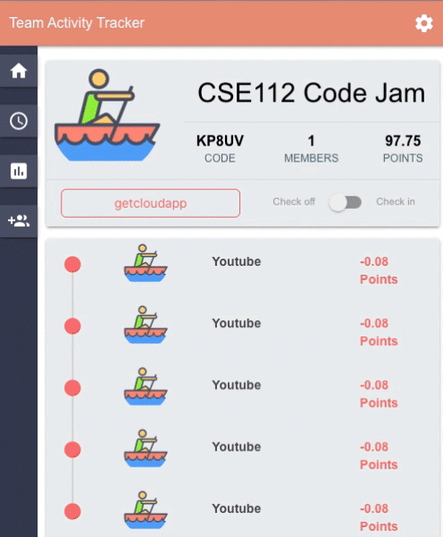

# Team Activity Tracker

<h4 align="center">A Google Chrome Extension Team Activity Tracker based on <a href="https://reactjs.org/" target="_blank">React</a>.</h4>

With the sudden changes to our everyday lives, remote work is now more prevalent in our everyday lives. Despite holding the same responsibility, remote work proposes new challenges to productivity. The difference in environment can be a huge factor that affects one’s concentration and task management. Working at home opens doors to limitless distractions such as Youtube, Facebook, and other social media platforms that constantly seek our attention. We are in a situation where team accountability is at an all time high when the only thing standing between your teammates is a screen. To promote productivity, we introduce ___ to monitor team activity as a reinforcement for avoiding distractions and procrastination.

## Demo

